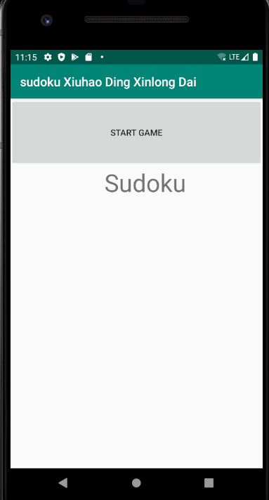
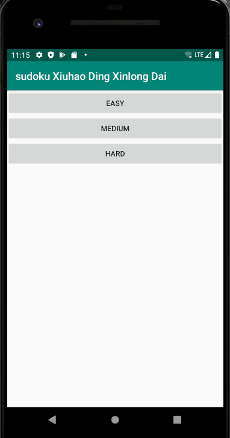
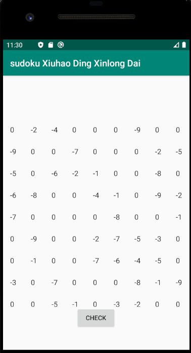
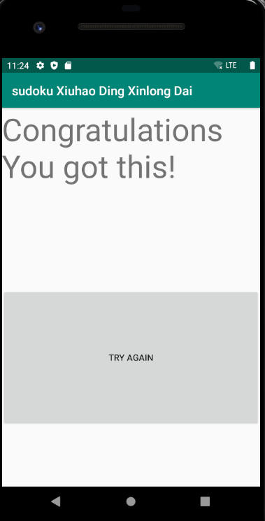

# Sudoku
Simple Sudoku Apps.
We use Andriod Studio to construct a simple Sudoku Apps, and using API to get random sudoku instances with different difficulty levels.

Main files are in app/src/main/java/com/example/sudokuxiuhaodingxinlongdai.

## Authors and acknowledgment
Xinlong Dai

Xiuhao Ding

## This is our youtube introduction link: https://www.youtube.com/watch?v=ohsjbQTZPkA and below is a image flow intro.

The first page is the start page, you can click Start to continue.

The second page is the difficult level choosing page, you can choose the random sudoku problems among easy, medium and hard.

The third page is the problem solving page,the negative numbers mean that they can't be changed and they are the original information that provide to the players, while for others, you can click it to increase it's value between 1 to 9.

You can click check at any time you want. If your answer is false, nothing will happened.If you are right, then you will go to the last page. Congratulations! You can click Try again to have another try. 

